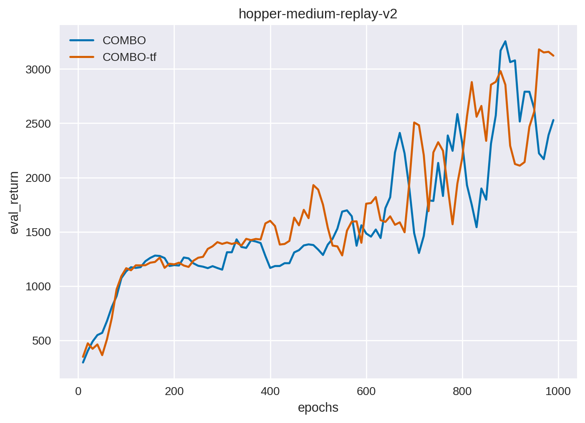
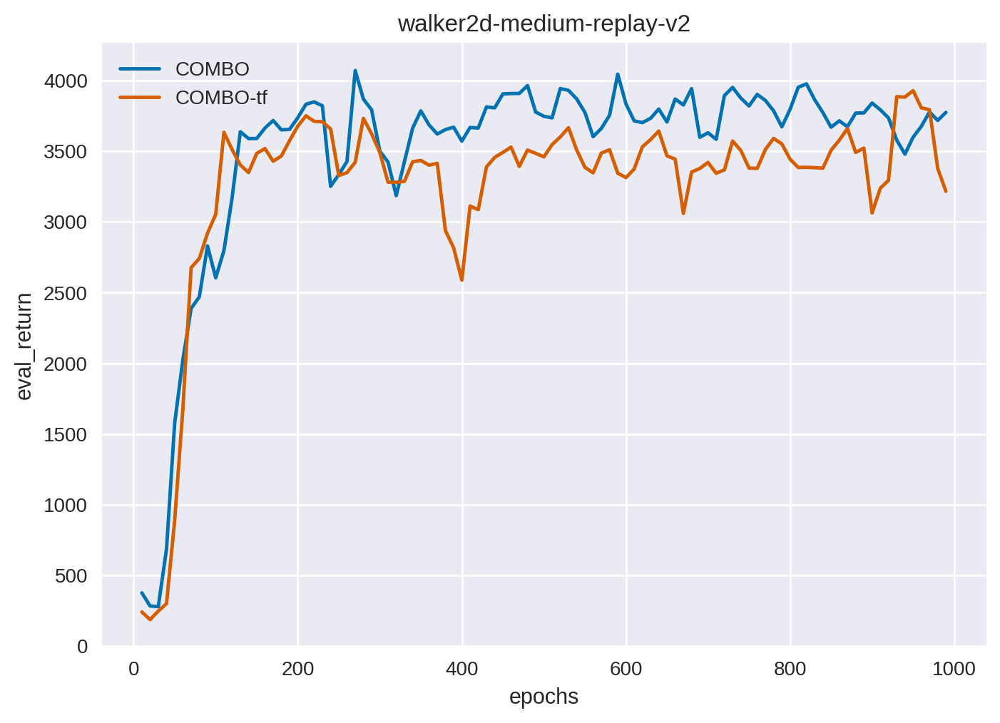
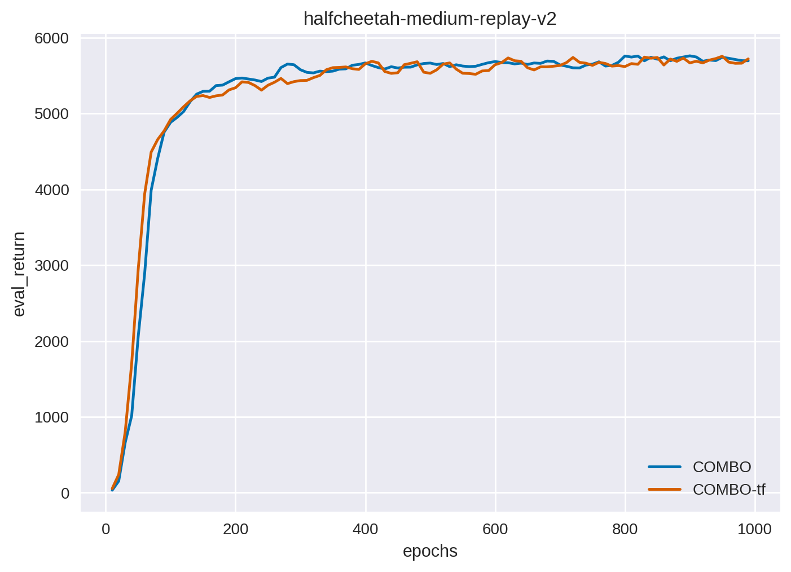

# Overview
We provide a torch implementation of offline model-based reinforcement learning algorithm COMBO described in the following paper [COMBO: Conservative Offline Model-based Policy Optimization](https://arxiv.org/pdf/2005.13239.pdf)

The implementation of ensemble dynamics model will have an important impact on the performance of model-based RL algorithm. So both tensorflow dynamic model and pytorch dynamic model are tested. For tensorflow model, we don't find offcial code for COMBO, so we reuse the official version in [MOPO: Model-based Offline Policy Optimization](https://arxiv.org/pdf/2005.13239.pdf), which is proposed by the same research team. But in our implementation, there are no significant differences between two version of dynamic model.

# Main Dependencies
- gym 0.22.0
- torch 1.13.0
- d4rl 1.1
- mujoco 2.3.0 

If you hope to run a tensorflow dynamic model, it's required : **tensorflow 2.x**

# Usage

## train

```
# for hopper-medium-replay-v2 task by torch dynamic model
python main.py --task hopper-medium-replay-v2

# for hopper-medium-replay-v2 task by tensorflow dynamic model
python ./agent_tf/main.py --task hopper-medium-replay-v2

```
You can adjust hyberparameters in **config.py**
## plot

```
python plot.py --task hopper-medium-replay-v2

```

# Results
All experiments were run by random seed 0.
### hopper-medium-replay-v2



### walker2d-medium-replay-v2



### halfcheetah-medium-replay-v2



# Reference

- Official tensorflow implementation for mopo: [https://github.com/tianheyu927/mopo](https://github.com/tianheyu927/mopo)
